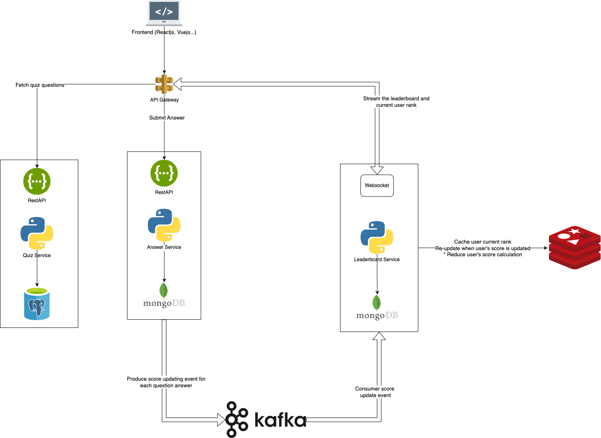

# Real-Time Vocabulary Quiz System


## 📌 Overview
This project is a solution to the **Real-Time Quiz Coding Challenge**, designed for an English learning application. The system provides a real-time quiz experience where users can answer questions, compete with others, and see their scores updated live on a leaderboard.

### 🔑 Key Features
- **Real-Time Participation**: Users can join a quiz session using a unique quiz ID.
- **Real-Time Score Updates**: Scores are updated instantly as users submit their answers.
- **Real-Time Leaderboard**: Displays current rankings of all participants, with real-time updates.

---

## 🛠️ Architecture
The system follows a microservices-based architecture designed for scalability, performance, and real-time capabilities.

### **Components**
1. **Quiz Service**: Manages the creation and management of quizzes.
3. **Answer Service**: Processes user answers, calculates scores, and handles re-answered questions.
4. **Leaderboard Service (I've implemented this component)**: 
   - Tracks users' scores and rankings in real-time.
   - Adjusts scores if users change their answers.
   - Provides live updates on the leaderboard.

---

## 📚 Technologies Used
### List of technologies used in the project:
- **Backend Framework**: FastAPI (Python)
- **Database**: 
    - PosgreSQl: quiz question management
    - MongoDB: storing user answers and scores
- **Message Broker**: Kafka (real-time communication between services)
- **WebSocket**: For real-time leaderboard updates
### Explanation of the technologies choice:
- **FastAPI**: FastAPI is a modern, fast (high-performance). It is easy to use, fast to develop, and provides automatic interactive API documentation.

- **PostgreSQL**: we need to store quiz detail info and quiz-related metadata (such as quiz questions, options, and correct answers), so PostgreSQL is strong support for structured data and relational operations.
    - ACID properties to ensure data integrity.
    - Consistency
    - Relational Data Model

- **Why MongoDB**: because it is highly suited for use cases where we need to handle a large volume of real-time, rapidly changing data.
    - Document-Oriented Storage
    - High Write Throughput
    - Scalability and Horizontal Scaling

---

## 🔄 Data Flow
1. Users join a quiz session by providing a `quiz_id`.
2. Users submit answers via the **Answer Service**:
    - Calulates the score based on the answer.
    - Calulates the adjusted score if the user re-answers the question (this score will be updated to the leaderboard).
3. The score of the answer will be produced to Kafka with format:
    ```json
    {
        "quiz_id": "quiz123",
        "user_id": "user1",
        "score": 10
    }
4. The **Leaderboard Service** consumes events from kafka and updates scores and broadcasts real-time updates.
5. The leaderboard displays the top participants and the user's current rank.

---

## 🚀 Implementation
I implemented the **Leaderboard Service**, which handles:
- Real-time score tracking.
- Score adjustments when users answer/re-answer questions.
- Providing users with their current ranking on the leaderboard.

### **1. Quiz Service Details**
#### Database Schema (PostgreSQL)
> **Note**: Ensure that the `quiz_id` is unique for each quiz chanllenge to avoid conflicts and ensure accurate score tracking.
- **Quiz Table**:
    ```json
    {
        "quiz_id": 1,
        <!-- Other detail info of the quiz -->
    }
- **Question Table**:
    ```json
    {
        "question_id": 1,
        "quiz_id": 1,
        "question": "What is the capital of France?",
        "options": ["A: Paris", "B: London", "C: Berlin", "D: Rome"],
        "correct_answer": "A",
        "score": 10
    }
### **2. Answer Service Details**
#### Databaes Schema
- **Answer Collections**:
    ```json
    {
        "user_id": "user1",
        "quiz_id": "quiz123",
        "question_id": "1",
        "answer": "A",
        "is_correct": true,
        "score": 10,
        "update_ts": "2024-11-10T10:15:30Z"
    }
### **3. Leaderboard Service Details**
#### Database Schema
- **Leaderboard Collection**:
    ```json
    {
        "user_id": "user1",
        "quiz_id": "quiz123",
        "score": 50
    }
#### Real-time functionality
- Users receive updates via WebSocket periodically for:
    - Currenly leaderboard default top 10 users
    - The user's current rank

### **4. Kafka Configuration**
- **Topic**: `score_updates`
- **Producer**: **Answer Service**
    - Produces score updates for each user.
- **Consumer**: **Leaderboard Service**
    - Consumes score updates and updates the leaderboard.
    - Broadcasts real-time updates to users.
- Kafka score update event schema
    ```json
    {
        "quiz_id": "quiz123",
        "user_id": "user1",
        "score": 10
    }

## Future Improvements
- **User Authentication**: Implement user authentication to prevent unauthorized access to quiz sessions.
- **Scalability**: Implement horizontal scaling for services to handle a large number of concurrent users.
- **Caching Frequently Accessed Data**: Use Redis for caching to improve performance and reduce database load.
- **Kafka Client with multiple partitions**: Implement Kafka client with multiple partitions to handle high throughput.
- **Dockerize Services**: Dockerize services for easy deployment and scaling.
- **Monitoring and Logging**: Implement monitoring and logging to track system performance and errors.